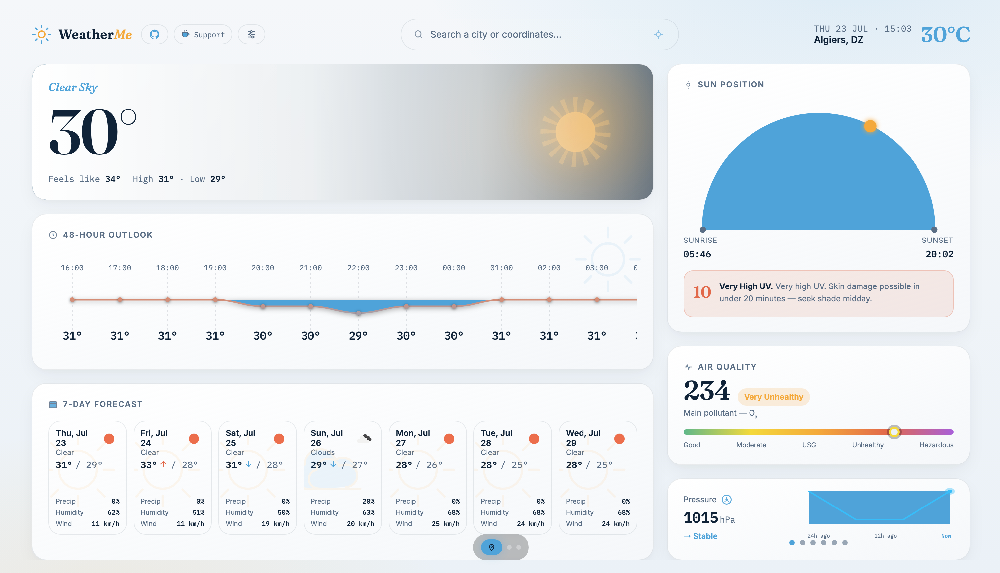
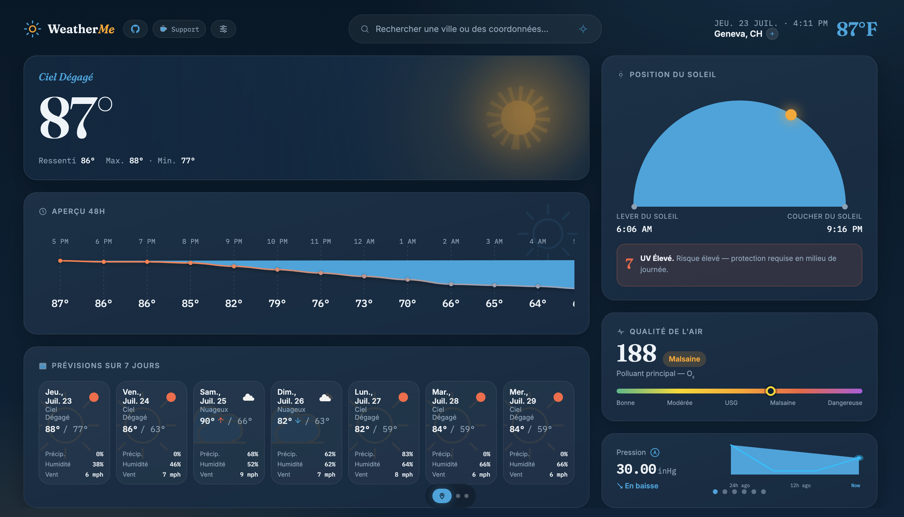

# 🌦️ React Weather App

A modern and responsive weather application built with **React** that provides real-time weather information for cities worldwide using the **OpenWeather API**.

The application follows a component-based architecture and focuses on clean UI, reusable components, state management with React Context API, and multilingual support using internationalization.

Users can search for cities and view detailed weather information including temperature, humidity, wind speed, weather conditions, sunrise, and sunset times.

---

## 📸 Preview

<p align="center">
  
</p>

<p align="center">
  
</p>

---

## ✨ Features

- 🔍 Search weather information by city
- 🌡️ Display current temperature and weather conditions
- 💧 Show humidity levels
- 💨 Display wind speed information
- 🌅 Sunrise and sunset time details
- 🌍 Multi-language support with i18n
- ⚛️ Component-based React architecture
- 🔄 Global state management using React Context API
- 📱 Fully responsive design
- ⚡ Fast and lightweight application
- 🎨 Clean and intuitive user interface

---

## 🛠️ Built With

### Frontend

- React 18
- JavaScript (ES6+)
- CSS3
- React Context API
- Internationalization (i18n)

### API

- OpenWeather API

### Development Tools

- npm
- Git
- GitHub

---

## 🏗️ Architecture

The application follows a modular React architecture:

```
User Interface
      |
      ↓
React Components
      |
      ↓
Context API (Global State)
      |
      ↓
Weather Services / Helpers
      |
      ↓
OpenWeather API
```

### Main responsibilities:

- **Components**
  - Handle reusable UI elements and page sections.

- **Context API**
  - Manages shared weather-related state across components.

- **Helpers**
  - Handles utility functions such as formatting and data transformation.

- **i18n**
  - Provides localization and language support.

- **OpenWeather API**
  - Provides real-time weather information.

---

## 📁 Project Structure

```
react-weather-app/
│
├── assets/
│   └── screenshots/
│       ├── screenshot-1.png
│       └── screenshot-2.png
│
├── public/
│
├── src/
│   │
│   ├── components/
│   │   ├── WeatherCard/
│   │   ├── SearchBar/
│   │   └── ...
│   │
│   ├── contexts/
│   │   └── WeatherContext.jsx
│   │
│   ├── helpers/
│   │
│   ├── locales/
│   │   ├── en/
│   │   └── ...
│   │
│   ├── styles/
│   │
│   ├── imgs/
│   │
│   ├── App.jsx
│   ├── constants.js
│   ├── i18n.js
│   └── index.js
│
├── .env.example
├── package.json
└── README.md
```

---

# 🚀 Getting Started

## Prerequisites

Make sure you have installed:

- Node.js
- npm

Check versions:

```bash
node -v
npm -v
```

---

## 📦 Installation

Clone the repository:

```bash
git clone https://github.com/Moh-mmed/react-weather-app.git
```

Navigate into the project:

```bash
cd react-weather-app
```

Install dependencies:

```bash
npm install
```

---

# 🔑 Environment Variables

This project requires an OpenWeather API key.

Create a `.env` file in the project root:

```env
REACT_APP_OPENWEATHER_API_KEY=your_api_key_here
```

You can create a free API key from:

https://openweathermap.org/api

---

# ▶️ Running the Application

## Development mode

Start the development server:

```bash
npm start
```

The application will run locally:

```
http://localhost:3000
```

---

## Production build

Create an optimized production build:

```bash
npm run build
```

---

## Run Tests

```bash
npm test
```

---

# 🌐 API Integration

The application uses the OpenWeather API to retrieve:

- Current weather information
- Temperature data
- Humidity
- Wind speed
- Sunrise and sunset times
- Weather conditions

API responses are processed and displayed through reusable React components.

---

# 🔮 Future Improvements

Planned improvements:

- [ ] Weather map integration
- [ ] Weather history
- [ ] Improved animations
- [ ] TypeScript migration
- [ ] Unit and integration testing

---

# 🤝 Contributing

Contributions are welcome.

To contribute:

1. Fork the repository

2. Create a new branch:

```bash
git checkout -b feature/new-feature
```

3. Commit your changes:

```bash
git commit -m "Add new feature"
```

4. Push the branch:

```bash
git push origin feature/new-feature
```

5. Open a Pull Request

---

# 📄 License

This project is licensed under the MIT License.

---

# 👨‍💻 Author

**Mohmmed Ben Aoumeur**

GitHub:
https://github.com/Moh-mmed
